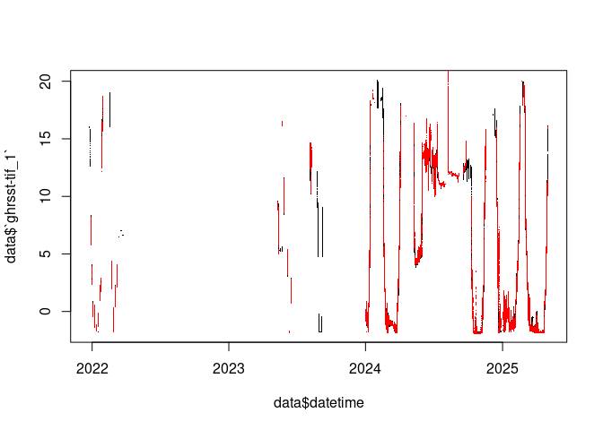

<!-- README.md is generated from README.Rmd. Please edit that file -->

# nuyina.envdata

<!-- badges: start -->
<!-- badges: end -->

The goal of nuyina.envdata is to copy satellite environmental data onto
the Nuyina undwerway dataset.

The data result is in this Parquet (the names of columns are likely to
change).

    https://projects.pawsey.org.au/idea-objects/nuyina-envdata.parquet

So in R

``` r
env <- arrow::read_parquet("https://projects.pawsey.org.au/idea-objects/nuyina-envdata.parquet")
names(env)  ## sst, sea ice, altimetry, various
#> [1] "gml_id"                           "NSIDC_SEAICE_PS_S25km_1"         
#> [3] "SEALEVEL_GLO_PHY_L4_adt"          "SEALEVEL_GLO_PHY_L4_sla"         
#> [5] "SEALEVEL_GLO_PHY_L4_ugos"         "SEALEVEL_GLO_PHY_L4_vgos"        
#> [7] "antarctica-amsr2-asi-s3125-tif_1" "ghrsst-tif_1"                    
#> [9] "oisst-tif_1"

get_underway <- function(x) {
  ## read the bulk
  d <- arrow::read_parquet("https://github.com/mdsumner/nuyina.underway/raw/main/data-raw/nuyina_underway.parquet")
  ## read the rest
  d1 <- tibble::as_tibble(vapour::vapour_read_fields("WFS:https://data.aad.gov.au/geoserver/ows?service=wfs&version=2.0.0&request=GetCapabilities",
                                                     sql = sprintf("SELECT * FROM \"underway:nuyina_underway\" WHERE datetime > '%s'",
                                                                   format(max(d$datetime, "%Y-%m-%dT%H:%M:%SZ")))))
  dplyr::bind_rows(d, d1)

}

## reads a cached Parquet and gets more recent rows from the geoserver
uwy <- get_underway()

(data <- dplyr::inner_join(env, uwy, "gml_id"))
#> # A tibble: 713,277 × 95
#>    gml_id   NSIDC_SEAICE_PS_S25k…¹ SEALEVEL_GLO_PHY_L4_…² SEALEVEL_GLO_PHY_L4_…³
#>    <chr>                     <dbl>                  <dbl>                  <dbl>
#>  1 nuyina_…                     NA                     NA                  0.103
#>  2 nuyina_…                     NA                     NA                  0.103
#>  3 nuyina_…                     NA                     NA                  0.103
#>  4 nuyina_…                     NA                     NA                  0.103
#>  5 nuyina_…                     NA                     NA                  0.103
#>  6 nuyina_…                     NA                     NA                  0.103
#>  7 nuyina_…                     NA                     NA                  0.103
#>  8 nuyina_…                     NA                     NA                  0.103
#>  9 nuyina_…                     NA                     NA                  0.103
#> 10 nuyina_…                     NA                     NA                  0.103
#> # ℹ 713,267 more rows
#> # ℹ abbreviated names: ¹​NSIDC_SEAICE_PS_S25km_1, ²​SEALEVEL_GLO_PHY_L4_adt,
#> #   ³​SEALEVEL_GLO_PHY_L4_sla
#> # ℹ 91 more variables: SEALEVEL_GLO_PHY_L4_ugos <dbl>,
#> #   SEALEVEL_GLO_PHY_L4_vgos <dbl>, `antarctica-amsr2-asi-s3125-tif_1` <int>,
#> #   `ghrsst-tif_1` <dbl>, `oisst-tif_1` <dbl>, set_code <chr>, datetime <dttm>,
#> #   latitude <dbl>, longitude <dbl>, platform_heave_down <dbl>, …

## so now compare GHRSST with underway temp


plot(data$datetime, data$`ghrsst-tif_1`, pch = ".")
points(data$datetime, data$sea_water_temperature, pch = ".", col = "red")
```


We’re running this on Pawsey with

    module load singularity/4.1.0-slurm


    cd $MYSCRATCH/nuyina.envdata

    singularity exec $MYSOFTWARE/sif_lib/gdal-builds_rocker-gdal-dev-python.sif   R CMD BATCH --no-restore --no-save  extract.R > run.Rout

Using 64 cores and reasonable memory this runs in under 5 minutes. We
get OISST, GHRSST, AMSR sea ice (3.125km), NSIDC seaice (25km), and
various altimetry products sla, adt, ugos, vgos.

## Code of Conduct

Please note that the nuyina.envdata project is released with a
[Contributor Code of
Conduct](https://contributor-covenant.org/version/2/1/CODE_OF_CONDUCT.html).
By contributing to this project, you agree to abide by its terms.
